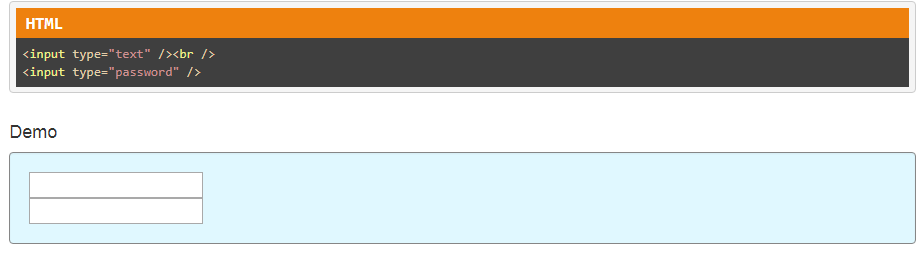
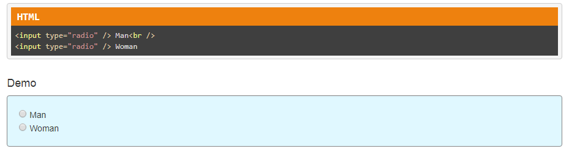
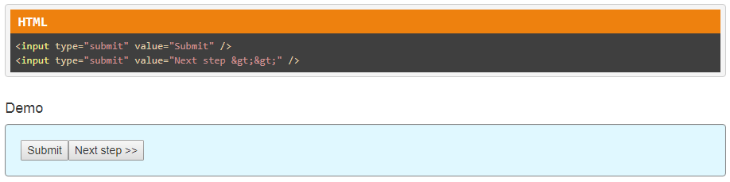
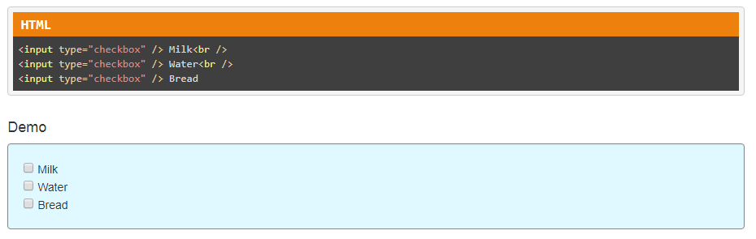
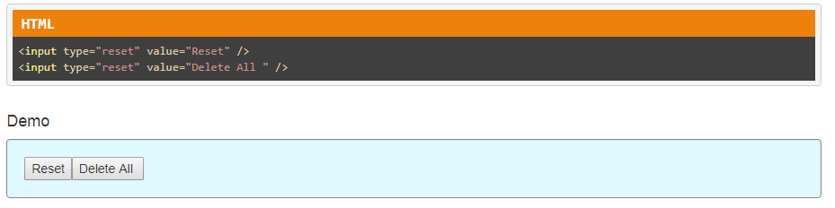

## Input

The input tag does not need an ending tag and can have numerous attributes:
<ui>
  <li> text </li>
  <li> password </li>
  <li> radio </li>
  <li> checkbox </li>
  <li> reset </li>
  <li> submit </li>
</ul>

### Sources
 <a href='https://tutorialehtml.com/en/html-tutorial-input-tag/' target='_blank' rel='nofollow'>tutorialehtml.com</a>
