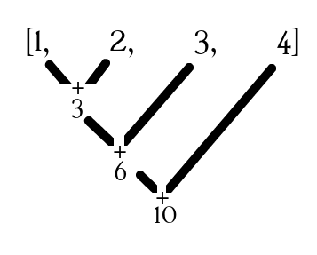

`reduce()` is a built-in python function `reduce(function, sequence)`, it applies a particular function to a sequence continually until just one element is left. It then returns this element as the result of the reduce()

## Note
In Python 3+ `reduce()` function has to be imported from `functools` library, like: `from functools import reduce`

## Arguments
`reduce(function, sequence)`
This function takes in two arguments a function and a sequence.


## Code Sample

Let's create a simple program that adds each number in a list using reduce() and lambda expression.

    ```
    >>> from functools import reduce
    >>> my_list = [1,2,3,4]
    >>> reduce(lambda x, y: x+y, my_list)
    10
    ```
Let's checkout the diagram below to make this more clear:



As you can see in the above example the `reduce()` function takes in two items at a time from the sequence and adds them up, then it adds the result with the third item and so on, until only one value is remaining. 

Let's see one final example that prints out the maximum value in a list:

	```
	>>> from functools import reduce
	>>> my_list = [23,49,72,5]
	>>> reduce(lambda x,y: x if x > y else y, my_list)
	72
	```

<a href='https://docs.python.org/3/library/functools.html#functools.reduce' target='_blank' rel='nofollow'>Python Doc - Reduce</a>
